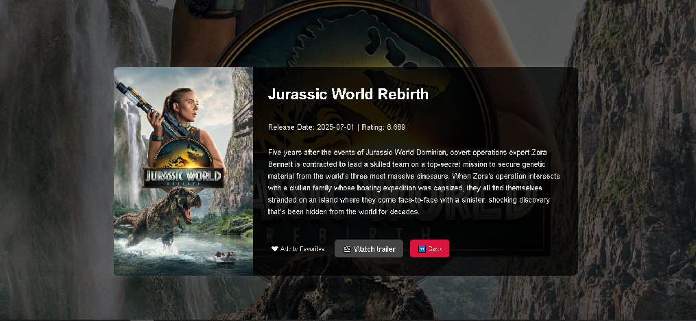

# My Portfolio

This portfolio showcases my frontend development skills, including JavaScript (ES6), HTML, CSS, responsive design, and practical implementation of real-world features. It was built to demonstrate proficiency and support my job applications.

## 🛠️ Technologies Used

- JavaScript (ES6)
- HTML5
- CSS3
- Axios
- Parcel (as the bundler)
- EmailJS (for contact form functionality)

## 📁 Projects

The portfolio contains the following independent projects, each structured using the MVC architecture.

---

### 1. 🚀 Landing Page


- **Purpose:** Personal presentation and contact form.
- **Features:**

  - Clean layout built with pure CSS
  - Responsive design
  - Theme change option
  - Working contact form integrated with [EmailJS](https://www.emailjs.com/)

  

- **Live Demo:** [https://marko-portfolio-landingpage.netlify.app](https://marko-portfolio-landingpage.netlify.app)
- **Code:** [GitHub Repo](https://github.com/MarkoSimic0605/My-Portfolio/blob/main/src-portfolio/index.html)

---

### 2. 🧮 Dashboard CRUD App


- **Purpose:** Demonstrates CRUD operations with users.
- **Features:**

  - Display, add, edit, and delete users
  - Data fetched from a static JSON file and stored in LocalStorage
  - Search with debounce
  - Pagination and toast notifications

  

- **Note:** No user authentication or admin levels. Built for showcasing functionality.
- **Live Demo:** [https://marko-dashboard-crud.netlify.app](https://marko-dashboard-crud.netlify.app)
- **Code:** [GitHub Repo](https://github.com/MarkoSimic0605/My-Portfolio/tree/main/src-portfolio/projects/dashboard-crud)

---

### 3. 🎬 Movie App (TMDB API)


- **Purpose:** Movie browsing and detail preview SPA.
- **Features:**

  - Fetching movie data using [TMDB API](https://developer.themoviedb.org/)
  - Search functionality
  - Single Page Application (SPA)
  - Trailer preview and movie detail page
  - Add/remove favorites using LocalStorage

  

- **Live Demo:** [https://marko-movieapp-spa.netlify.app](https://marko-movieapp-spa.netlify.app)
- **Code:** [GitHub Repo](https://github.com/MarkoSimic0605/My-Portfolio/tree/main/src-portfolio/projects/movie-app-spa)

---

### 4. 🛒 E-commerce


- **Purpose:** Shopping cart demo with product browsing.
- **Features:**

  - Fetching product data via dummy API
  - Product listing with image, description, and price
  - Add to cart, remove single item or all
  - Cart dropdown with total price calculation
  - Pagination, category filters, and search
  - Data stored in LocalStorage
  - Toast notifications for cart updates

  

- **Live Demo:** [https://marko-ecommerceshop.netlify.app](https://marko-ecommerceshop.netlify.app)
- **Code:** [GitHub Repo](https://github.com/MarkoSimic0605/My-Portfolio/tree/main/src-portfolio/projects/ecommerce/src)

---

## 📦 Project Structure

Each project follows the MVC pattern:

- **Model:** Manages data (API calls, LocalStorage, etc.)
- **View:** Handles DOM rendering and user interface
- **Controller:** Coordinates logic between model and view

Bundling is handled by **Parcel**, chosen for its zero-config setup and ease of use for beginners.

Project selection is managed using a CLI prompt (`start.js`) built with `inquirer`, which allows easy development of individual apps.

## 🚀 Getting Started Locally

To run any project locally:

### 1. Clone the Repository

```bash
git clone https://MarkoSimic0605@github.com/MarkoSimic0605/My-Portfolio.git
cd My-Portfolio
```

### 2. Install Dependencies

```bash
npm install
```

### 3. Start a Project

Run the following command to open the project selector CLI:

```bash
npm start
```

Then choose a project:

- Landing Page
- Dashboard CRUD
- Movie App (TMDB)
- E-commerce App

Alternatively, run a specific app manually:

```bash
npm run dev:landing       # For Landing Page
npm run dev:dashboard     # For Dashboard CRUD
npm run dev:movie         # For Movie App
npm run dev:ecommerce     # For E-commerce App
```

## 🌐 Deployment

The portfolio is deployed using [Netlify](https://www.netlify.com/). For SPA routing, a `_redirects` file is added to each `dist-` folder after build.

## 📬 Contact

For inquiries or collaborations: **Email:** \[[marco.simic1987@gmail.com](mailto:marco.simic1987@gmail.com)]

---

> Built with 💻 by Marko

# My-Portfolio
